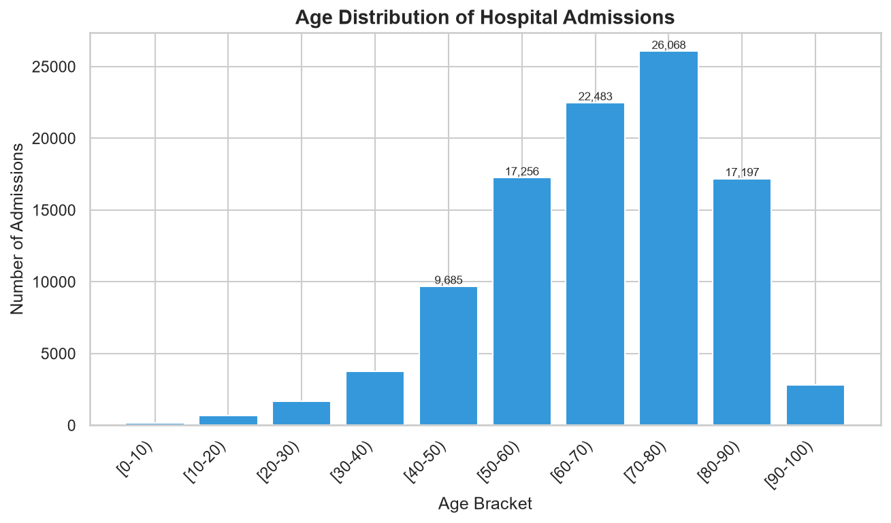
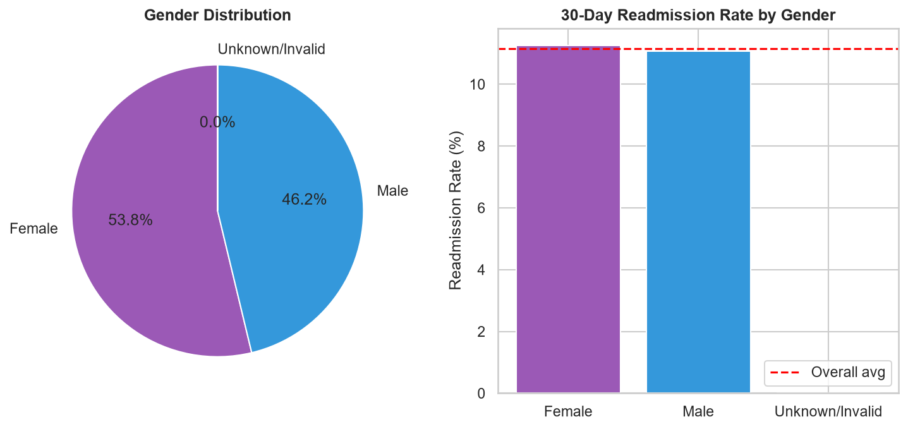
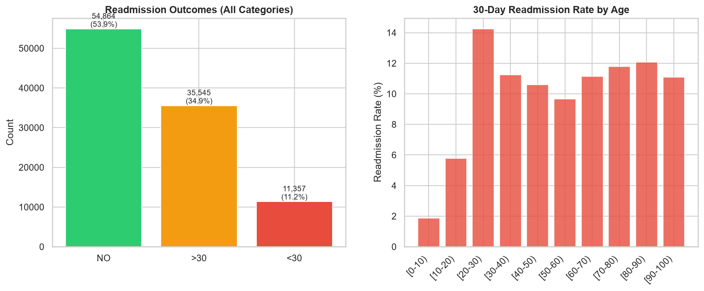
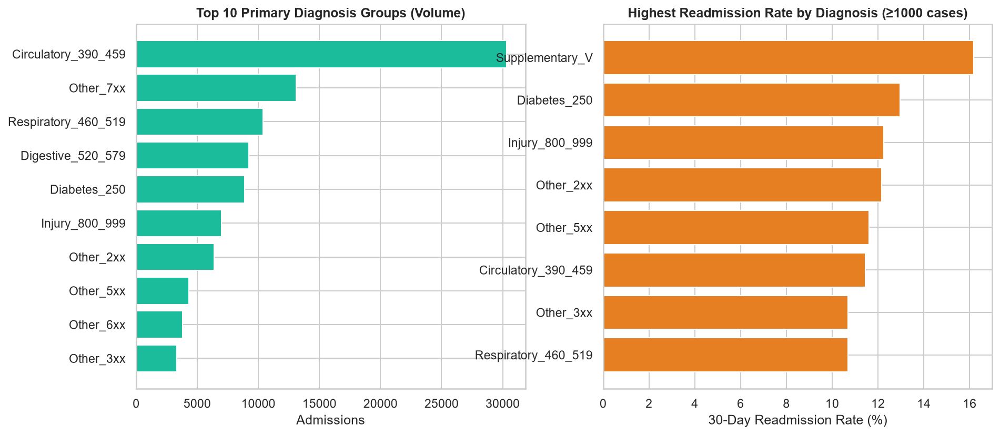
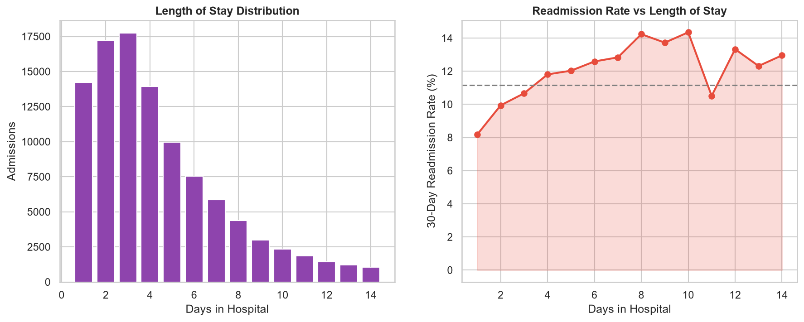
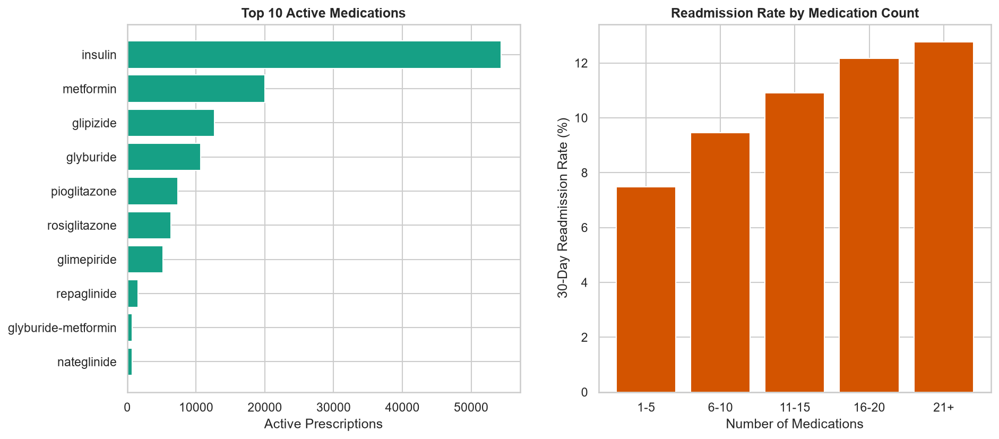
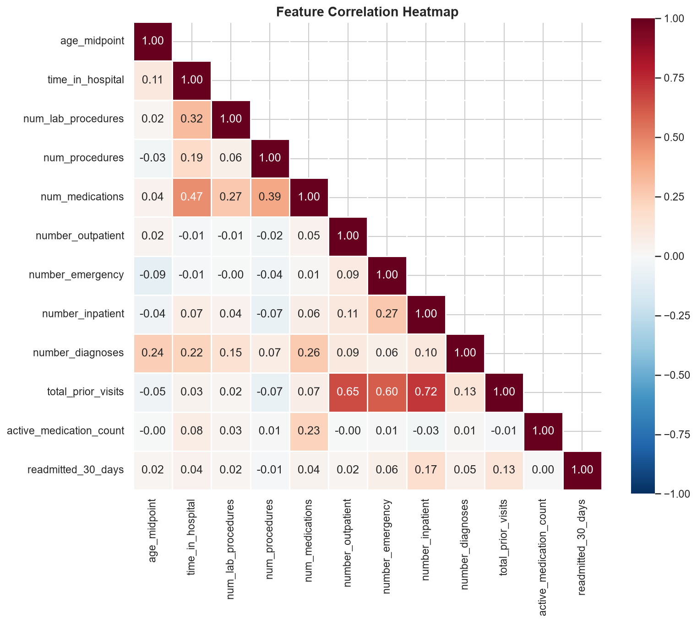

# Phase 4 — Exploratory Data Analysis (Complete)

## Overview

EDA performed on **101,766** cleaned admissions with **7 visualizations** and business insights for each.

| Chart | File |
|-------|------|
| Age distribution | `reports/eda_plots/01_age_distribution.png` |
| Gender distribution | `reports/eda_plots/02_gender_distribution.png` |
| Readmission trends | `reports/eda_plots/03_readmission_trends.png` |
| Diagnosis analysis | `reports/eda_plots/04_diagnosis_analysis.png` |
| Length of stay | `reports/eda_plots/05_length_of_stay.png` |
| Medication analysis | `reports/eda_plots/06_medication_analysis.png` |
| Correlation heatmap | `reports/eda_plots/07_correlation_heatmap.png` |

## Run EDA

```bash
python backend/scripts/run_eda.py
```

Or open `notebooks/02_eda.ipynb`.

---

## 1. Age Distribution



**Business Insight:** Admissions peak in the **[70-80)** bracket (26,068 encounters). Patients aged **60+** account for **67.4%** of all admissions. Hospital readmission programs should prioritize geriatric diabetic care — transitional care management (TCM) and post-discharge follow-up calls within 48 hours are critical for this cohort.

---

## 2. Gender Distribution



**Business Insight:** Females represent **53.8%** of admissions. 30-day readmission rates are nearly equal: Female **11.25%** vs Male **11.06%**. Gender alone is not a strong segmentation variable; combine with age and prior utilization for risk stratification.

---

## 3. Readmission Trends



**Business Insight:**
- **11.16%** readmitted within 30 days (CMS Hospital Readmissions Reduction Program metric)
- **34.9%** readmitted after 30 days
- **53.9%** never readmitted

Hospitals face Medicare penalties when 30-day readmission rates exceed national averages. The `[20-30)` bracket shows the highest *rate* (smaller sample); `[70-80)` has the highest *volume* of readmissions due to population size.

**Action:** Deploy readmission risk scoring at discharge for all patients 60+ with prior inpatient history.

---

## 4. Diagnosis Analysis



**Business Insight:**
- **Circulatory disease (390-459)** is the top primary diagnosis (30,336 cases) — heart failure, hypertension complications common in diabetics
- **Supplementary V codes** show **16.2%** readmission rate (highest among high-volume groups)

**Action:** Create diagnosis-specific discharge bundles — e.g., CHF patients get weight monitoring instructions; diabetes patients get A1C follow-up scheduling.

---

## 5. Length of Stay Analysis



**Business Insight:**
- Average LOS: **4.4 days** (median 4)
- LOS-readmission correlation: **0.044** (weak linear)

Most stays are 1–6 days. Longer stays (7–14 days) show elevated readmission rates, likely reflecting clinical severity rather than causing readmission.

**Action:** Focus on care complexity markers (medications, prior visits) rather than LOS alone when predicting risk.

---

## 6. Medication Analysis



**Business Insight:**
- **Insulin** is the most active medication (54,383 cases)
- Insulin patients: **12.1%** readmission vs **10.0%** without insulin
- Average **16 medications** per patient — significant polypharmacy

**Action:** Pharmacy-led medication reconciliation at discharge; flag patients on insulin + 15+ medications for pharmacist review and patient education.

---

## 7. Correlation Heatmap



**Business Insight:** Top predictors of 30-day readmission:

| Feature | Correlation |
|---------|-------------|
| Prior inpatient visits | 0.165 |
| Total prior visits | 0.126 |
| Prior emergency visits | 0.061 |

Prior healthcare utilization is the strongest signal. These features must be included in the ML model (Phase 5).

---

## Executive Summary for Hospital Administrators

| Finding | Implication |
|---------|-------------|
| 67% patients are 60+ | Target elderly transitional care programs |
| 11.16% 30-day readmit rate | Above national diabetic average — revenue at risk |
| Circulatory dx dominates | Cardiovascular-diabetes comorbidity pathways needed |
| Insulin = complexity | Use as clinical risk flag |
| Prior visits predict readmission | Build utilization-based risk score (0–100) |

## Outputs

- `backend/app/analytics/eda.py` — EDA module
- `backend/scripts/run_eda.py` — CLI runner
- `reports/eda_insights.json` — Structured insights
- `notebooks/02_eda.ipynb` — Interactive notebook

## Next Phase

**Phase 5 — Machine Learning:** Logistic Regression, Random Forest, XGBoost with hyperparameter tuning and SHAP explainability.

*Awaiting approval to proceed.*
